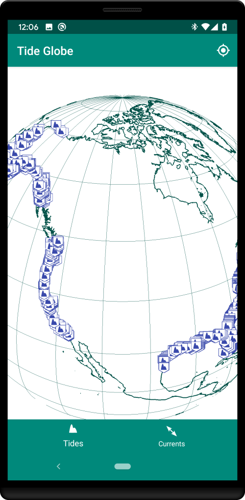
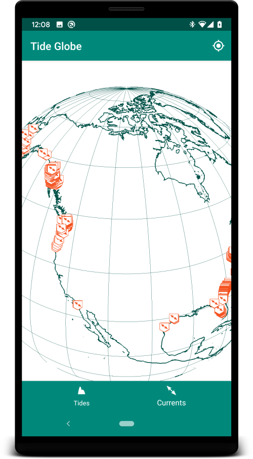

[Become a beta tester](https://play.google.com/apps/testing/com.mxmariner.tides)

# MX Tides - Android
#### Harmonic tide clock and tide predictor

* Android port of [Xtide 2 by David Flater](http://www.flaterco.com/xtide/)
* [Free on Google Play](https://play.google.com/store/apps/details?id=com.mxmariner.tides)
* [GPL LICENSE](gpl-3.0.md)
* [Disclaimer](http://www.flaterco.com/xtide/disclaimer.html) "NOT FOR NAVIGATION," "ABSOLUTELY NO WARRANTY"

      
